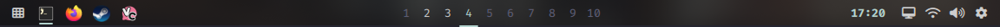

# Pilo bar

A desktop status bar for Hyprland. It sits on every monitor and replaces the
old bar, while notifications, the wallpaper picker, and the clipboard keep
working as before.

## The bar

Three sections, left to right:

**Left**
- **Launcher** — opens the application launcher.
- **Running apps** — icons for everything you have open.

**Center**
- **Workspaces** — the 1–10 workspaces. Click a number to switch. The active
  one is highlighted and underlined; occupied ones are brighter. You can show
  all ten or only the ones in use (bar settings).

**Right**
- **Clock** — 24-hour time. Click it to open the calendar.
- **Monitors** — arrange your screens and change their refresh rate and scale.
- **Network & Bluetooth** — connection status and controls.
- **Sound** — volume and output device.
- **Settings** — customize the bar.

Only one panel is open at a time. Click anywhere else to close it.

## Launcher

Two ways to open it:
- **Click the launcher icon** on the bar — it appears right under the icon.
- **Tap Super** — it opens as a centered window.

Type to search your applications, or switch to searching files. Results can be
sorted by name, most recently used, or most frequently used. Press **Tab** to
switch between apps and files. The buttons along the bottom let you shut down,
reboot, sign out, or suspend; the destructive ones ask for confirmation first.
The search box is empty every time it opens.

## Calendar

Opens under the clock. Move between months with the arrows, the left/right
arrow keys, or the scroll wheel. Today is highlighted. Swedish holidays are
marked in amber; turn them off, or back on, in bar settings. Hovering a holiday
shows its name at the bottom.

## Control panels

- **Network & Bluetooth** — toggle Wi-Fi, pick a network, connect to a new one,
  and connect or disconnect paired Bluetooth devices.
- **Sound** — adjust volume, mute, and choose the output device.
- **Monitors** — reorder your screens left and right, and set each screen's
  refresh rate and scale. A Reset button restores the recommended settings.
  Changes apply immediately and are remembered.
- **Bar settings** — see below.

## Running apps

Icons for everything you have open, across all workspaces and monitors, grouped
by application. The focused app is underlined. More than a handful of apps
collapse into a `+N` button.

- **Left-click** an app to bring it to the front (if it has more than one
  window, you get the menu instead).
- **Right-click** an app for its menu: each window can be focused, closed
  politely, or force-killed (useful for apps that ignore the close button).
  You also get the application's own quick actions, like Steam's
  Store / Library / Friends or Firefox's New Private Window.

## Customizing the bar

Open the gear icon and everything applies instantly and is saved:

- **Chrome** — *Flush* (edge to edge), *Pill* (a floating bar), or *Islands*
  (separate capsules).
- **Edge** — top or bottom of the screen.
- **Opacity** and **Gap** (the spacing from the screen edge in Pill and Islands
  modes).
- **Workspaces** — show all, or only occupied ones.
- **Holidays** — none or Sweden.
- **Launcher sort** — the default ordering for search results.
- **File search** — turn searching files on or off.
- **Power profile** — Battery, Balanced, or Performance.

## Good to know

- The bar appears on every connected screen.
- Your preferences and your app usage history are saved between sessions.
- The layout is meant to feel consistent with the rest of the desktop: it is
  dark, understated, and keyboard-friendly.
